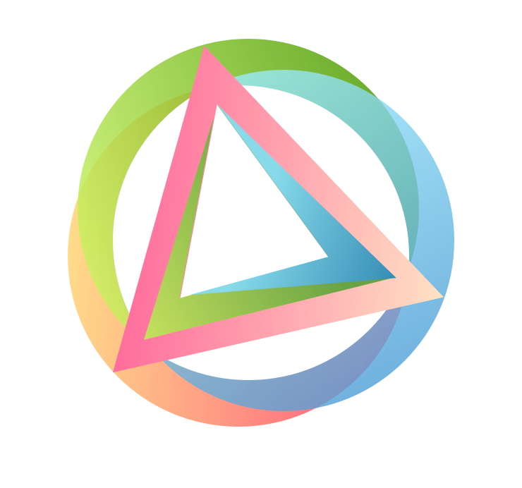
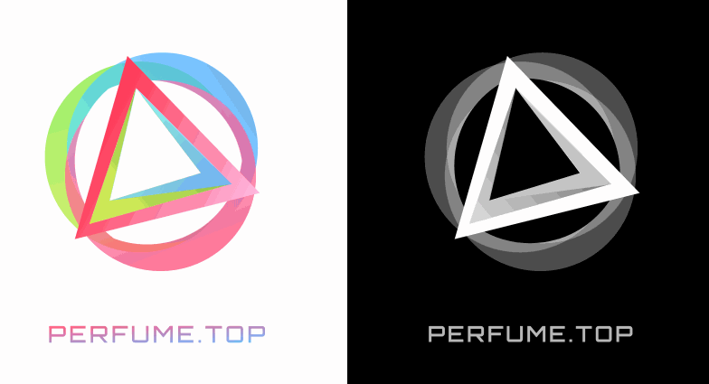

# 原型参考

## 风格 LOGO

目前版本如下:

 

[源文件](https://github.com/perfume-top/perfume-top/blob/master/resource/logo.sketch)

含义：中间三角代表perfume，周围圆圈环绕代表prfm fan
动画：三角先缓动组成，从世界点阵地图，升起圆点，通过缓动动画汇聚成圆圈环绕核心三角

## 动效改善

动效改进参考如下（AE制作）：

[回到创意灵感](../reference.md)