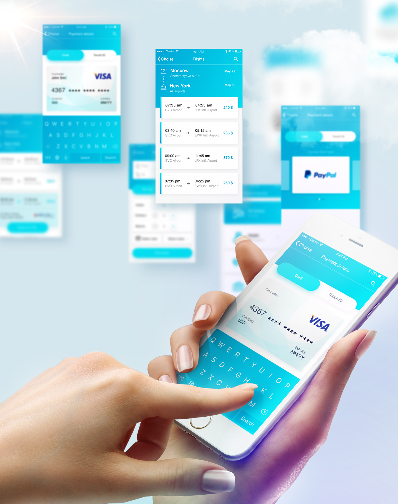
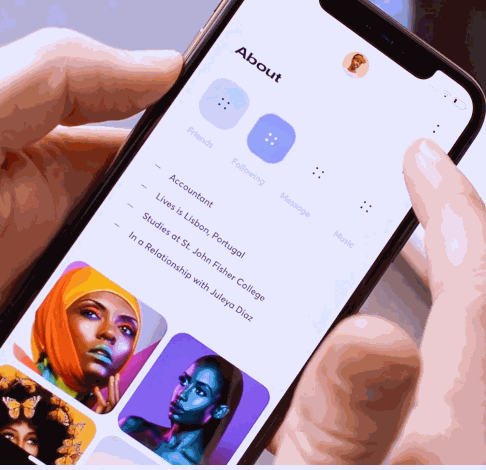

# 原型参考

## 风格

交互上比较贴近的风格（配色忽略过于饱和，内容有点空），更多[点击这里](./detail/reference-01.md)：

app的感觉（这个配色，比较单一可以有3种色调，但是渐变，纹理可以参考，比较容易体现科技感？），更多[点击这里](./detail/reference-01.md)

上面那个缺点是排版太古老，可以参考下面这个，更多[点击这里](./detail/reference-01.md#风格03补充)

### 配色参考

更多[点击这里](./detail/reference-color.md)

### LOGO

目前版本如下:

 

[源文件](https://github.com/perfume-top/perfume-top/blob/master/resource/logo.sketch)

动效改进参考，更多[点击这里](./detail/reference-logo.md)

## PC端

### 首页

首屏是一个沉浸式的页面， 背景可切换或有元素动画，下拉后沉浸页面打破，顶部固定为topbar。

下拉后出现的是内容浏览区，内容是perfume的简介，内容可能存在折叠，折叠部分点击后呈现，交互参考下图：

perfume3D化后作为背景交互，这个有点遥远...先摆在这

另一种全屏切换特效，不过这个需要黑色系，适用于视频

### Discography

TOUR或MV的列表页

另一种列表页与详情页

音乐列表页

### Biography

历程页面参考（弹出方式忽略，排版可参考）

## APP端

### Discography

列表页与详情页

## 动画

长页面中的交互元素

几何元素动效

全屏切换

tab切换

汇聚动效

消息动效

全屏动效

社交动效

旋转

[回到项目](./project.md)