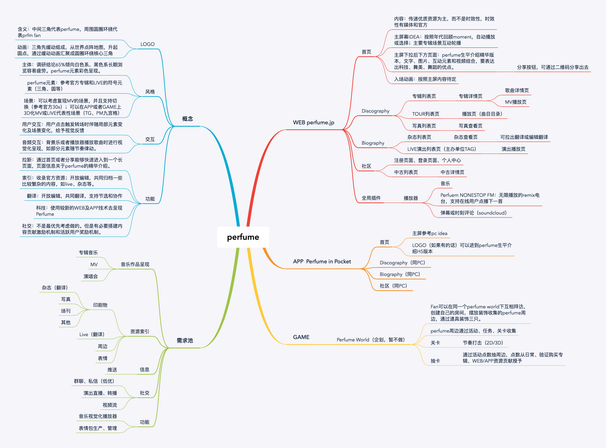

# 创意灵感

本文档记录关于平台的各种灵感和想法。

## 概览

[XMind文件](../../resource/perfume.mind)

## 需求池

### 音乐作品呈现

- 专辑音乐
- MV
- 演唱会

### 资源索引

- 印刷物

	- 杂志（翻译）
	- 写真
	- 场刊
	- 其他

- Live（翻译）
- 周边
- 表情

### 信息

- 推送

### 社交

- 群聊、私信（低优）
- 演出直播、转播
- 视频流

### 功能

- 音乐视觉化播放器
- 表情包生产、管理

## 概念

### LOGO

- 含义：中间三角代表perfume，周围圆圈环绕代表prfm fan
- 动画：三角先缓动组成，从世界点阵地图，升起圆点，通过缓动动画汇聚成圆圈环绕核心三角

### 风格

- 主体：调研结论65%倾向白色系，黑色系长期浏览容易疲劳。perfume元素彩色呈现。
- perfume元素：参考官方专辑和LIVE的符号元素（三角、圆等）
- 场景：可以考虑复现MV的场景，并且支持切换（参考官方30s）；可以在APP或者GAME上3D化MV或LIVE代表性场景（TG、PM九宫格）

### 交互

- 用户交互：用户点击触发转场时伴随局部元素变化及场景变化，给予视觉反馈
- 音频交互：背景乐或者播放器播放歌曲时进行视觉化呈现，如部分元素随节奏律动。

### 功能

- 拉新：通过首页或者分享能够快速进入到一个长页面，页面信息关于perfume的精华介绍。
- 索引：收录官方资源；开放编辑，共同归档一些比较繁杂的内容，如live、杂志等。
- 翻译：开放编辑，共同翻译，支持节选和协作
- 科技：使用较新的WEB及APP技术去呈现Perfume
- 社交：不是最优先考虑做的。但是有必要搭建内容贡献激励机制和活跃用户奖励机制。

## 网站 perfume.jp

### 首页

- 内容：传递优质资源为主，而不是时效性，时效性有媒体和官方
- 主屏幕IDEA：按照年代回顾moment，自动播放或选择；主要专辑场景互动轮播
- 主屏下拉后下方页面：perfume生平介绍精华版本，文字、图片、互动元素和视频结合，要表达出科技、舞美、舞蹈的优点。

	- 分享按钮，可通过二维码分享出去

- 入场动画：按照主屏内容待定

### Discography

- 专辑列表页

	- 专辑详情页

		- 歌曲详情页
		- MV播放页

- TOUR列表页

	- 播放页（曲目目录）

- 写真列表页

	- 写真查看页

### Biography

- 杂志列表页

	- 杂志查看页

		- 可拉出翻译或编辑翻译

- LIVE演出列表页（主办单位TAG）

	- 演出播放页

### 社区

- 注册页面、登录页面、个人中心
- 中古列表页

	- 中古详情页

### 全局插件

- 播放器

	- 音乐
	- Perfuem NONESTOP FM：无限播放的remix电台，支持在线用户点播下一首
	- 弹幕或时刻评论（soundcloud）

## 应用  Perfume in Pocket 

### 首页

### Discography（同PC）

### Biography（同PC）

### 社区（同PC）

## 游戏

### Perfume World（企划，暂不做）

- Fan可以在同一个perfume world下互相拜访，创建自己的房间，摆放装饰收集的perfume周边，通过道具装饰三只。
- perfume周边通过活动、任务、关卡收集
- 关卡

	- 节奏打击（2D/3D）

- 抽卡

	- 通过活动点数抽周边，点数从日常、验证购买专辑、WEB/APP资源贡献授予

[回到项目](./project.md)
